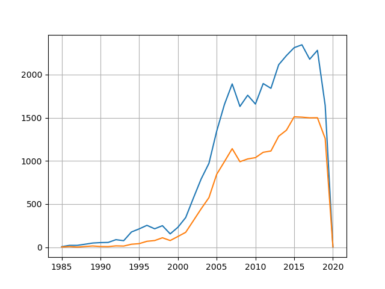
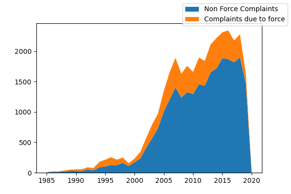
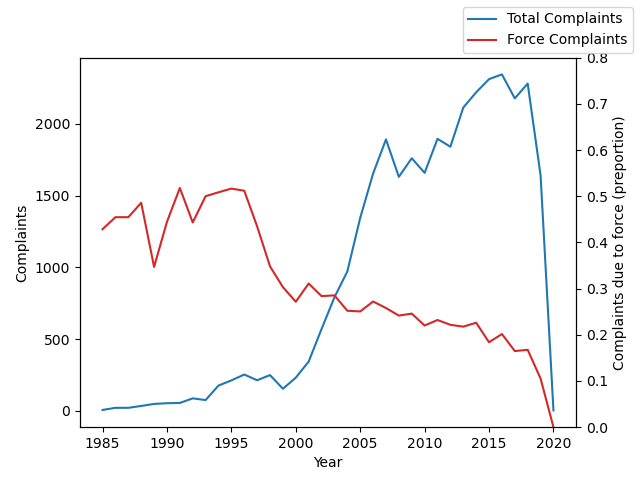
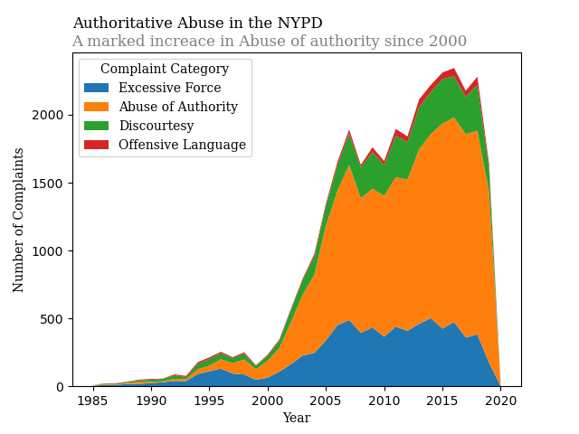
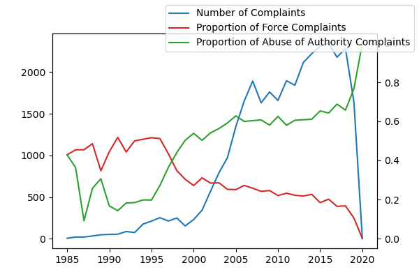

#+title: Project 2
#+author: Martin Hawks

* Setup :noexport:
#+begin_src emacs-lisp :results none :exports none :noeval
    (eval-after-load 'org
        (add-hook 'org-babel-after-execute-hook 'org-redisplay-inline-images))
#+end_src

#+begin_src python :results none :exports none :session
import pandas as pd
import numpy as np
import matplotlib.pyplot as plt

data = pd.read_csv('CCRB-Complaint-Data_202007271729/allegations_202007271729.csv')
#+end_src

* Grouping by ID :noexport:
#+begin_src python :results table :session :exports both
from sklearn.preprocessing import OneHotEncoder
manys = data['unique_mos_id'].value_counts() > 1
suspicious = data[manys[data['unique_mos_id']].values]
encoder = OneHotEncoder()
values = encoder.fit_transform(data[['fado_type']])
encoded = pd.DataFrame(values.toarray(), columns=encoder.get_feature_names_out())
data = pd.concat([encoded, data], axis=1)
disposition_categories = encoder.get_feature_names_out()
officer_result = pd.pivot_table(
    data[np.append(['unique_mos_id'], encoder.get_feature_names_out())],
    index='unique_mos_id',
    values=encoder.get_feature_names_out(),
    aggfunc=sum
)
officer_result['total_complaints'] = officer_result.sum(axis=1)
#+end_src

#+RESULTS:
| None |

* Use of Force scaling with complaint number
Here it is demonstrated how the preportion of complaints of excess force does not in fact grow at the same rate as the total complaints. Plotting only these two variables could imply that using less force led to more complaints, when it is neither clear that less force was actually used (the number of these complaints stayed fairly consistent), and Abuse of Authority complaints dramaticaly increased accounting for the large spike that the Force complaints dont scale with as well
** Misleading Plots
*** Preliminary plotting :noexport:
#+begin_src python :results file :session :exports results
filename = 'Yearplot.png'
byYear = data.groupby('year_received').count()
resultYear = data.groupby('year_received').sum()
plt.plot(byYear.index, byYear['last_name'])
plt.plot(resultYear.index, resultYear['fado_type_Abuse of Authority'])
plt.grid(visible=True)
plt.savefig(filename)
plt.close()
filename
#+end_src

#+RESULTS:

*** Stacked Plot (only force)
#+begin_src python :session :results file :exports results
fig, ax = plt.subplots(1, 1, figsize=(6, 4))
ax.stackplot(resultYear.index, (byYear['last_name'] - resultYear['fado_type_Force']), resultYear['fado_type_Force'], labels=['Non Force Complaints', 'Complaints due to force'])
filename = 'stackedYearPlotForce.png'
fig.legend()
fig.savefig(filename)
plt.close()
filename
#+end_src

#+RESULTS:

*** Proportion of Force
#+begin_src python :results file :session :exports results
font = plt.font_manager.FontManager(family='serif')
fig, ax1 = plt.subplots()
ax2 = ax1.twinx()
ax1.plot(byYear.index, byYear['last_name'], label="Number of Complaints")
ax2.plot(resultYear.index, resultYear['fado_type_Force'] / byYear['last_name'], color='tab:red', label="Force Complaints")
filename = 'ProportionForce.png'
ax1.set_xlabel('Year')
ax1.set_ylabel('Complaints')
ax2.set_ylabel('Complaints due to force (preportion)')
fig.legend()
plt.savefig(filename)
plt.close()
filename
#+end_src

#+RESULTS:

** Truthier Plots
*** Stacked Plot for all Categories
#+begin_src python :results file :session :exports results
plt.stackplot(resultYear.index, resultYear['fado_type_Force'], resultYear['fado_type_Abuse of Authority'], resultYear['fado_type_Discourtesy'], resultYear['fado_type_Offensive Language'], labels=['Force Complaints', 'Abuse of Authority', 'Discourtesy', 'Offensive Language'])
filename = 'StackedAll.png'
plt.legend()
plt.savefig(filename)
plt.close()
filename
#+end_src

#+RESULTS:

*** Proportion plot (Force and Abuse of Authority)
#+begin_src python :results file :session :exports results
fig, ax1 = plt.subplots(figsize=(6, 4))
ax2 = ax1.twinx()
ax1.plot(byYear.index, byYear['last_name'], label="Number of Complaints")
ax2.plot(resultYear.index, resultYear['fado_type_Force'] / byYear['last_name'], color='tab:red', label="Proportion of Force Complaints")
ax2.plot(resultYear.index, resultYear['fado_type_Abuse of Authority'] / byYear['last_name'], color='tab:green', label='Proportion of Abuse of Authority Complaints')
filename = 'PreportionForceAuth.png'
fig.legend()
fig.savefig(filename)
plt.close()
filename
#+end_src

#+RESULTS:

* Plots
I would like to in some way for the misleading plot imply that less usage of force results in a higher number of complaints agains the NYPD. Creating a stack plot was meant to display preportions in a way that didn't necessarily seem like it was misleading. The preportions didnt quite seems stark enough, so I did a multi axis plotting in order to exagerate the effects. In the less misleading plot, the multi axis plotting is a bit more confused, so the layered plot is meant to give a better idea of what the preporitons look like over time
